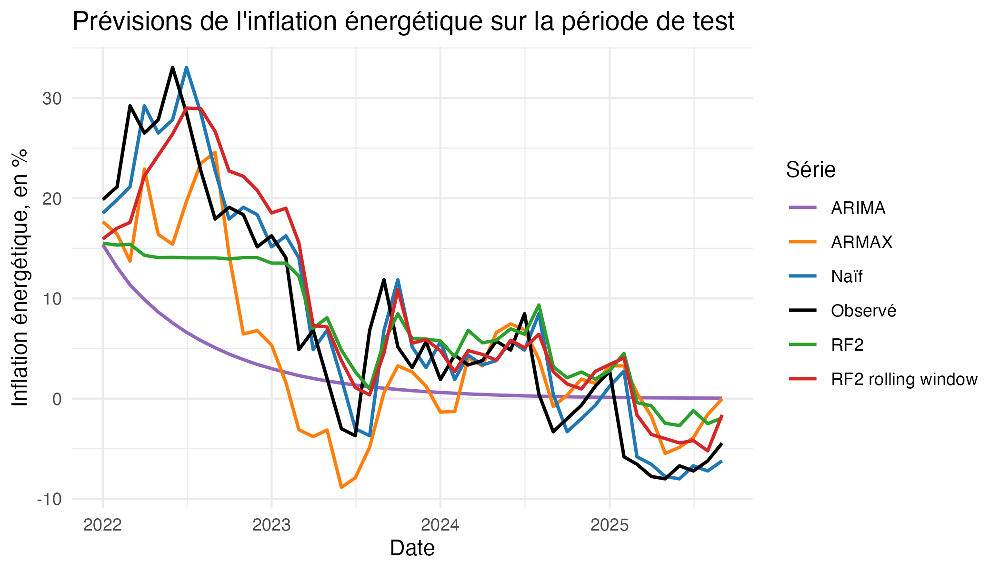
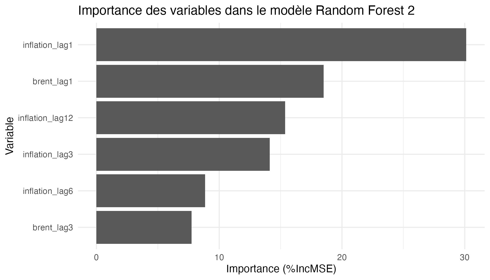

# Prévision de l'inflation énergétique en France

Projet réalisé dans le cadre de mon mémoire de Master 1 Économétrie Appliquée à l'IAE Nantes.

L'objectif est d'analyser et de prévoir l'inflation énergétique en France en comparant plusieurs approches économétriques et de machine learning, tout en évaluant leur capacité à prévoir une période particulièrement instable : la crise énergétique de 2022.

## Objectif

L'étude cherche à répondre à deux questions principales :

- Quels indicateurs permettent d'expliquer et d'anticiper l'évolution de l'inflation énergétique en France ?
- Les méthodes de machine learning, notamment le Random Forest, permettent-elles d'améliorer les prévisions par rapport aux modèles économétriques et aux méthodes de référence ?

## Données

L'analyse repose sur des données mensuelles allant de **juillet 2015 à septembre 2025**, soit 123 observations.

Les principales variables utilisées sont :

- indice des prix à la consommation de l'énergie ;
- prix du pétrole Brent en euros ;
- prix du gaz naturel TTF ;
- indice des matières premières importées hors énergie ;
- valeurs retardées de l'inflation énergétique.

Les données proviennent de l'INSEE.

L'échantillon est séparé chronologiquement :

- **Apprentissage :** juillet 2015 – décembre 2021
- **Test :** janvier 2022 – septembre 2025

Cette séparation permet notamment d'évaluer les modèles sur la crise énergétique de 2022 sans qu'ils aient été entraînés sur cette période.

## Méthodologie

Plusieurs modèles sont comparés :

- modèle naïf ;
- ARIMA ;
- régression linéaire ;
- ARMAX ;
- plusieurs spécifications de Random Forest ;
- Random Forest avec pondération des observations ;
- Random Forest en fenêtre glissante (*rolling window*).

Les performances hors échantillon sont évaluées à l'aide de plusieurs indicateurs : **RMSE, MAE, R² prédictif, corrélation et biais**.

Des tests de **Diebold-Mariano** sont également utilisés pour comparer les erreurs de prévision des modèles.

Enfin, la robustesse du Random Forest est étudiée sur **100 graines aléatoires**.

## Principaux résultats

| Modèle | RMSE | MAE | R² prédictif |
|---|---:|---:|---:|
| Naïf | **4.05** | **3.10** | **0.87** |
| Random Forest rolling window | 4.95 | 4.06 | 0.81 |
| Random Forest classique | 6.58 | 5.18 | 0.67 |
| ARMAX | 7.01 | 5.53 | 0.62 |
| ARIMA | 9.79 | 7.72 | 0.26 |

Le **modèle naïf obtient les meilleures performances globales**, ce qui met en évidence la forte persistance de l'inflation énergétique en glissement annuel.

Parmi les modèles plus complexes, le **Random Forest en fenêtre glissante** obtient les meilleures performances. Son adaptation progressive aux nouvelles observations améliore les prévisions par rapport au Random Forest classique.

L'analyse de l'importance des variables montre également que les **retards de l'inflation énergétique et du prix du Brent** jouent un rôle important dans les prévisions.

## Visualisations

### Prévisions des différents modèles



### Importance des variables du Random Forest



## Technologies utilisées

- **R**
- `forecast`
- `randomForest`
- `tseries`
- `tsoutliers`
- `gets`
- `leaps`
- `dplyr`
- `tidyr`
- `ggplot2`

## Structure du projet

```text
prevision-inflation-energie-france/
├── code/
│   └── analyse_prevision_inflation.R
├── data/
│   ├── raw/
│   └── processed/
├── figures/
├── rapport/
│   ├── memoire.pdf
│   └── note_synthese.pdf
└── README.md
```

- `data/raw` : données sources
- `data/processed` : données et résultats générés par l'analyse
- `code` : script R complet
- `figures` : visualisations produites par le script
- `rapport` : mémoire complet et note de synthèse

## Rapport

Le mémoire complet et sa note de synthèse sont disponibles dans le dossier [`rapport`](rapport/).

## Auteur

**Amélie Pires**

Master 1 Économétrie Appliquée — Économétrie linéaire avancée - IAE Nantes, 2025-2026.

## Contact

**Amélie Pires**

[LinkedIn](https://www.linkedin.com/in/amelie-pires) · [GitHub](https://github.com/aps-18)

